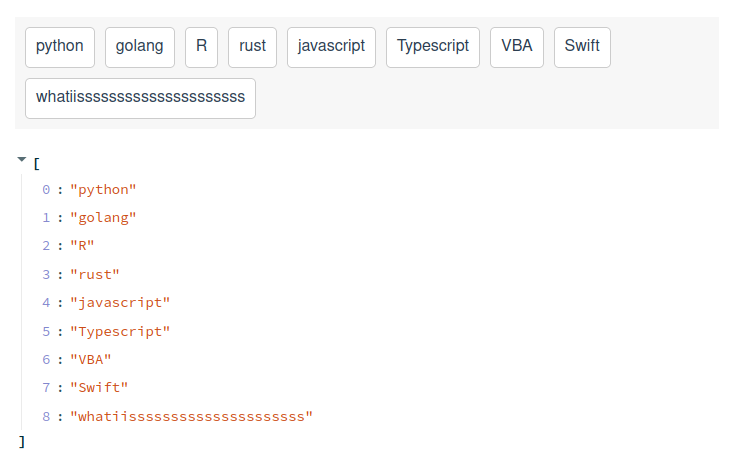

# Streamlit sortable list component

A streamlit component to sort a list of elements in selection box by drag and drop.

### Install 

```
pip install streamlit-sortable-list
```

### How to use

```
import streamlit as st
from streamlit_sortable_list import sort_selections 

items = ["python", "javascript", "golang", "rust", "R", "Typescript", "VBA", "Swift", "whatiisssssssssssssssssssss"]
sorted_items = sort_selections(items)
st.json(sorted_items)
```




